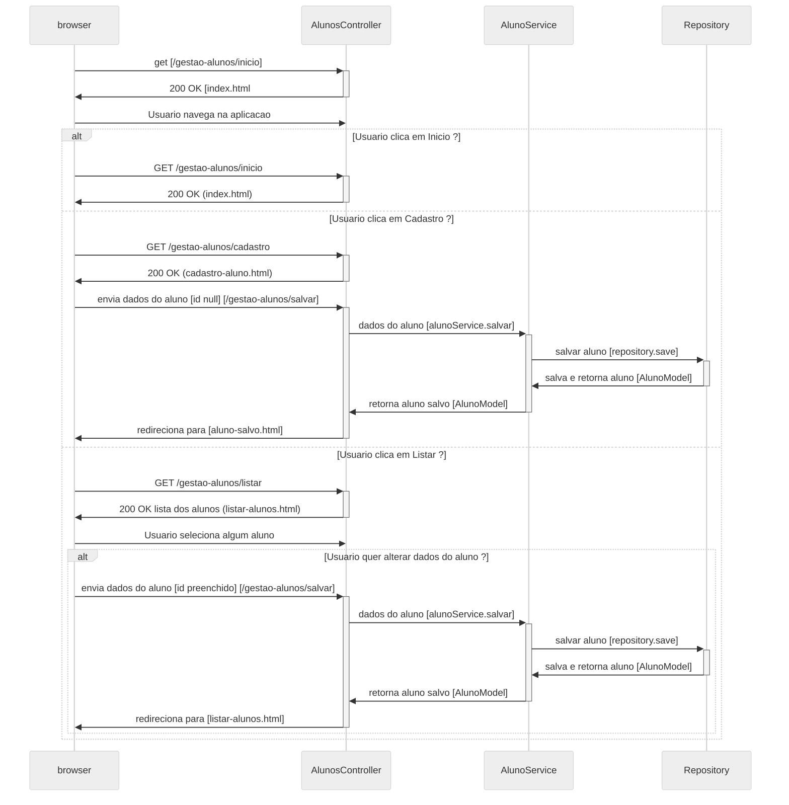

# gestao-alunos
Aplicação para gerenciar cadastro de alunos [CRUD]

## Tecnologias
- Java 17
- Spring Boot
- Spring Data JPA
- Spring Web
- MySQL
- Docker

## Tecnologias desabilitadas
- Flyway

## Pré-Requisitos
- Ter o Docker-Desktop instalado e Inicializado.
- Ter um console para visualizar o MySQL, como o MySQL Workbench ou DBeaver.

## Configuração
- Criar um banco de dados MySQL
  - Configurações executadas pelo arquivo `docker-compose.yml`
  - `Start`, executar o arquivo `docker-compose.yml` com o comando:
    - `docker-compose up -d`
  - `Stop`, executar o arquivo `docker-compose.yml` com o comando:
    - `docker-compose down`
  - <b>Não executar</b> com o comando `docker-compose down -v`, pois irá remover o volume `mysql_data` e os dados serão perdidos

  ### Orientações do banco de dados MySQL
  - [1] - Para manter os dados persistidos entre uma execução e outra do container, é necessário criar um <b>volume</b> para o container do MySQL.
  - [2] - Esse volume foi criado e já consta no arquivo `docker-compose.yml`
  - [3] - O nome do volume é `mysql_data`, caso contrário o nome seria `compose_mysql_data`, pois o nome do diretório onde o arquivo `docker-compose.yml` está localizado é `compose`.
  - [4] - `driver: local`, para armazenar os dados localmente
  - [5] - `volume`, caso seja removido o volume com o comando `docker-compose down -v`, os dados serão perdidos, e será necessário criar um novo volume através do comando `docker-compose up` ou `docker-compose up -d`.

## Comandos auxiliares
 - Listar volumes
   - `docker volume ls`, para listar os volumes
   - `docker volume inspect mysql_data`, Isso mostrará a localização do volume no sistema. Se o caminho estiver errado ou vazio, significa que os dados não estão sendo salvos.
  

## Sequence Diagram

